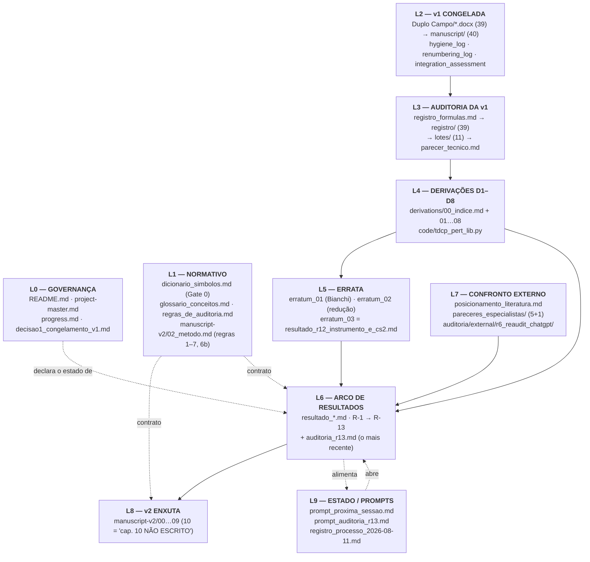

# AUDITORIA DE CORPUS — mapa de relações, desatualização e redundância

**Data:** 2026-08-17. **Alvo:** o repositório inteiro, não um resultado
físico. Esta auditoria não recalcula nada: ela pergunta se o corpus,
como *documento*, ainda diz a verdade sobre si mesmo.

**Distinção que organiza o relatório** (a mesma do Erratum-03): separo
**enunciado** de **suporte documental**. Nenhum enunciado físico cai
aqui. O que cai são pontos onde o *documento* afirma um estado que os
próprios arquivos do repositório já contradizem.

---

## 0. Cobertura e cegueira declarada (regra 7, aplicada a esta auditoria)

| O que | Profundidade |
|---|---|
| `README.md`, `docs/project-master.md`, `docs/progress.md`, `docs/decisao1_congelamento_v1.md`, `docs/auditoria_r13.md`, `docs/prompt_auditoria_r13.md`, `docs/prompt_proxima_sessao.md` | **leitura integral** |
| 61 `docs/*.md`, 10 `manuscript-v2/*.md`, 11 `derivations/*.md`, 5 `auditoria/*.md` | **títulos + cabeçalho + varredura por marcadores** (banner, veredito, erratum, data, supersessão) + leitura integral onde o marcador acusou |
| 39 `auditoria/registro/*.md`, 11 `auditoria/lotes/*.md` | **amostragem** (C01, lote_01, AL) + estatística |
| 40 `manuscript/` (v1 congelada), 39 `.docx` | **não lidos** — v1 é registro histórico imutável (Decisão 1) e a auditoria dela já existe (`parecer_tecnico.md` + lotes) |
| 103 `.py`, 66 `out/*.txt` | **não lidos linha a linha** — analisados por cobertura (script ↔ saída ↔ citação) |
| `Duplo Campo.zip` | **não aberto** (pendência de 2026-07-02, ainda aberta) |

**O que esta auditoria não consegue ver:** se o *conteúdo físico* de um
documento está certo. Ela vê datas, ponteiros, banners, órfãos e
contradições entre documentos. Um doc perfeitamente atualizado e
perfeitamente errado passa por ela intacto.

**Segunda cegueira, medida:** a varredura de duplicação textual literal
(linhas > 90 caracteres repetidas em ≥ 3 arquivos) achou **apenas 2
casos**, ambos boilerplate gerado em `auditoria/registro/`. Ou seja: a
redundância deste corpus **não é copiar-e-colar — é reescrita à mão do
mesmo conteúdo**. Isso é pior, porque as cópias divergem sem que um
`diff` acuse, e foi assim que os itens §2 abaixo apareceram.

---

## 1. O MAPA — nove camadas e o sentido do fluxo

O corpus tem 183 arquivos markdown de projeto, e eles não são um monte:
formam uma cadeia de nove camadas com direção bem definida.

### 1.1 Os hubs (grau de entrada — quem o corpus mais cita)

| Cit. | Documento | Papel |
|---|---|---|
| 20 | `docs/resultado_r12_instrumento_e_cs2.md` | Erratum-03; o filtro de **valor** de todo o arco |
| 19 | `docs/resultado_r13b_ibb_ramo_infinito.md` | a medida do IBB |
| 19 | `docs/resultado_r13a_criterio_higuchi_fonte.md` | a tradução do critério da fonte |
| 17 | `docs/resultado_ramo_finito.md` | o fundo — **um dos poucos resultados ainda de pé** |
| 17 | `docs/posicionamento_literatura.md` | a face voltada a paper |
| 15 | `docs/resultado_r7_cascata.md` | o filtro de **enunciado** do Erratum-02 (§4) |
| 15 | `docs/resultado_r12i_confronto_konnig.md` | o confronto com 1407.4331 |
| 14 | `derivations/02_setor_tensorial_mT2.md` | a caixa de `m_T²` |
| 14 | `integration_assessment.md` | o veredito dos Apêndices I–K |

**Leitura do mapa:** o corpus tem **dois filtros de supersessão** e eles
são de naturezas diferentes — `r7_cascata.md` §4 filtra *enunciados*
(Erratum-02) e `resultado_r12_instrumento_e_cs2.md` §6 filtra *valores*
(Erratum-03). O `README.md` §"Scientific State" manda aplicar os dois.
**Toda a integridade do corpus depende desses três arquivos**, e é
exatamente aí que estão os dois achados mais graves abaixo.

### 1.2 Órfãos verdadeiros (nada aponta para eles)

- `docs/resultado_r1_reavaliacao.md`, `resultado_r4b_forma.md`,
  `resultado_r4c_confronto.md`, `resultado_r5_confrontos.md` — **e são
  precisamente quatro dos documentos que o Erratum-02 derrubou.**
  Órfãos nos dois sentidos: nada os cita, e eles não citam nada vigente.
- `auditoria/external/r6_reaudit_chatgpt/reports/R6_reaudit_report.md`
  — o relatório externo que **originou o Erratum-02**. Nenhum `.md` o
  cita pelo caminho; `erratum_02` cita a pasta, não o relatório.
- `docs/glossario_conceitos.md` (23 KB, o manual de leitura),
  `docs/registro_processo_2026-08-11.md`, `manuscript/eng-version/CHAPTER-1.md`.
- `docs/prompt_proxima_sessao.md` e `docs/prompt_auditoria_r13.md` —
  órfãos por natureza (são pontos de entrada), o que é correto.

*Falso positivo declarado do detector:* 14 de 39 arquivos de
`auditoria/registro/` aparecem como órfãos porque os lotes os citam em
forma abreviada (`C01.md … C05.md`). Não é achado.

---

## 2. O QUE ESTÁ DESATUALIZADO

| # | Item | Gravidade |
|---|---|---|
| D-1 | O `README.md` não incorporou a auditoria de 2026-08-17 | **alta** |
| D-2 | O diagnóstico `r′ < 0` continua vigente em 8 arquivos | **alta** |
| D-3 | Erratum-02 sem propagação editorial: 22 docs, **0 banners** | **alta** |
| D-4 | `prompt_proxima_sessao.md` — 5 filas concorrentes, parado em 08-13 | média |
| D-5 | `progress.md` termina numa ação cancelada pela Decisão 1 | média |
| D-6 | `posicionamento_literatura.md` ainda vende o `−6.05e−5` | média |
| D-7 | Housekeeping do `M_eff²` executado pela metade | baixa |
| D-8 | O rótulo "`→ 12` ⟹ Higuchi automático" sobrevive em 3 pontos | baixa |
| D-9 | `prompt_auditoria_r13.md` é prompt gasto, sem marca de executado | baixa |

### D-1 — O README declara um estado de 4 dias atrás

`README.md` §"Scientific State (**2026-08-13**)" é o primeiro arquivo
que qualquer leitor do repositório público abre. Ele **não menciona
`docs/auditoria_r13.md`**, e três das suas frases já foram movidas:

1. *"A `c_s²` test in the IBB is desirable additional validation, not a
   requirement"* — **a validação foi feita.** `auditoria_r13.md` §4:
   `c_s² > 0` em **50/50** pontos, de `+1/2` no passado profundo a `+1`
   no atrator. A frase de complementaridade deixou de ter uma perna
   emprestada; o README ainda a descreve como emprestada.
2. O veredito é apresentado como *"Higuchi ghost, `r′ < 0` throughout
   the history"*. A **recomendação normativa** da auditoria (§6.2) é
   trocar isso por `𝒲′(r) > 0` — porque sob `β_n(φ₋)`, **que é a
   arquitetura da v2**, `r′` troca de sinal e o LHS(15) **não se move**
   (medido: `−21.8751` nos quatro cenários). O veredito sobrevive; o
   argumento com que o README o defende, não.
3. Não registra a nova fronteira epistêmica — **a eq. (14) sob
   modulação** (§6.3), que a auditoria declara "o item mais caro da
   fila, substitui a P-6".

### D-2 — O diagnóstico errado está replicado em 8 arquivos

O bloco `[VEREDITO — 2026-08-13, R-13a + R-13b]` aparece em:

`docs/resultado_r10_consolidado.md` · `resultado_r10c_saidas.md` ·
`resultado_r11_nogo_gradiente.md` · `resultado_r12b_teorema_cs2.md` ·
`resultado_r12i_confronto_konnig.md` · `manuscript-v2/05_fundo_ramo_finito.md` ·
`07_setor_escalar.md` · `09_programa_observacional.md`

**Nenhum dos oito cita `docs/auditoria_r13.md`.** Os oito repetem
"`r′ < 0` em toda a história". É literalmente o **item 2 da fila que a
própria auditoria abriu** ("barato, e imuniza o enunciado contra a v2"),
ainda não executado. Custo estrutural: como as cópias foram **reescritas
à mão** e não coladas, a correção tem de ser feita oito vezes, à mão,
sem que um `grep` de bloco idêntico ajude.

### D-3 — O Erratum-02 nunca foi propagado para os documentos que ele matou — **RESOLVIDO em 2026-08-17**

> **[EXECUTADO.]** Os **13** documentos contaminados receberam banner
> não-destrutivo no topo, cada um nomeando *o que exatamente morreu* e
> *qual é o sucessor*. Nenhum número histórico foi alterado. Ver §4-bis.

**Correção de escopo desta auditoria (importante).** A 1ª versão deste
relatório falava em **22 documentos**. **Errado, e por excesso.** O
Erratum-02 §1 nomeia os scripts que replicam `reduz_ponto`; verifiquei
por `grep` no código:

> `d2_evolucao_reduzida` · `gatef_a_constraint` · `gatef_b_canonica` ·
> `r1_reavaliacao_nogo_evolucao` · `r2_fantasma_estrutural` ·
> `r3_faseB_evolucao_rolagem` · `r3b_pousada_parametrico` ·
> `r3c_pousada_mecanismo` · `r4a_mapa_tardio` · `r4b_forma_da_banda` ·
> `r4c_confronto_epocas` · `r5_confrontos_paper`

São **12 scripts → 13 documentos** (os dois `gatef_*` mais o doc do
Gate F que os encomenda). Os outros 9 que eu havia listado —
`d1_reducao`, `investigacao1`, `investigacao2_faseA/B`,
`stuckelberg_goldstone`, `veredito_setor_escalar_final`,
`no_go_beta_constante`, `estrutura_par_relativo`,
`resultado_setor_escalar` — **não contêm `reduz_ponto`** (verificado) e
foram superados por **outro** mecanismo (a suspensão do espectro
congelado pelo D-2, e depois a retirada do no-go de classe pelo R-7f).
Pôr neles um banner de "artefato do Erratum-02" seria exatamente o erro
que o corpus policia: atribuir a causa errada a uma queda real.

**O estado antes da correção era:** dos 13, **nenhum** carregava banner,
nota de topo ou sequer a string "Erratum-02".

Os dois casos que mordem:

- **`resultado_r5_confrontos.md`** anuncia a previsão de excesso de ISW
  como resultado nível-paper. Essa previsão foi **RETIRADA**. O arquivo
  não diz isso em lugar nenhum, e é órfão no grafo.
- **`resultado_gatef_b.md`** conclui um "fantasma canônico a
  `ω₀ ≈ 3–4·Λ₃`" com número. Era **artefato**. O arquivo lê-se como
  vigente.

**Este é o achado mais grave da auditoria**, e é assimétrico de um jeito
revelador: o Erratum-03 e o arco R-13 **ganharam banners in loco** (R-9,
R-10a, R-10c, R-11, R-12b, R-12i, R-13a, R-13b — todos anotados). O
Erratum-02, que é *maior*, ganhou só uma tabela num terceiro arquivo. A
disciplina de banner nasceu **depois** do Erratum-02 e nunca foi
aplicada retroativamente. O item existia na fila (`prompt_proxima_sessao`,
adendo 4, fila item 2: *"Propagação editorial do erratum-02: banners de
supersessão nos docs históricos afetados"*) — e essa fila foi marcada
`SUPERSEDED` inteira, levando o item junto.

### D-4 — `prompt_proxima_sessao.md`: cinco filas, duas leituras obrigatórias, uma data errada

O arquivo declara-se *"Atualizado 2026-08-12"* e tem 436 linhas com
**7 adendos**. Estado medido:

| Bloco | Linha | Situação |
|---|---|---|
| `FILA (pos-R-12)` | 248 | parcialmente superada pelo adendo 7 |
| `FILA QUE O R-13a/R-13b DEIXA` | 370 | vigente até 08-13 |
| `FILA (adendo 4) — SUPERSEDED` | 390 | morta, mantida |
| `FILA (nova)` | 391 | superada pelo adendo 5 |
| `FILA (ordem recomendada) — SUPERSEDED` | 410 | morta, mantida |
| `LEITURA OBRIGATORIA` | 264 | diz substituir a do adendo 4 |
| `LEITURA OBRIGATORIA ANTES DE QUALQUER COISA` | 403 | diz substituir "a lista anterior" |

Os adendos não estão em ordem: o 6 vem depois do 5 mas antes do 7, e as
filas mais antigas estão **no fim**. **Zero menção à auditoria de
2026-08-17.** É o arquivo que o método manda abrir primeiro numa sessão
nova — e ele entrega ao leitor duas ordens de leitura contraditórias.

### D-5 — `progress.md` termina numa ação cancelada

Última linha: *"Próximo passo: regenerar os `.docx` finais (e PDFs) a
partir do Markdown consolidado em `manuscript/`, substituindo os
arquivos em `Duplo Campo/`."* Isso foi **cancelado** pela Decisão 1
(2026-08-11, §2 item 3). O `project-master.md` recebeu o banner
`SUPERSEDED`; o `progress.md`, que descreve a mesma etapa, não.

### D-6 — `posicionamento_literatura.md` ainda vende o número de grade

O arquivo recebeu três anotações de 08-17 (P-5 **RESOLVIDA**, P-6
**FECHADA**, elo do gradiente **FECHOU**) — mas duas passagens não
foram tocadas:

- **§1.1b (L189):** *"max `r′` = −6.05e−5 na varredura inteira"*
- **tabela de evidência (L632):** idem, como nível `M-13b (2a + 2b)`

`auditoria_r13.md` §5.2 demonstra que esse número é **valor do último
ponto da grade** e escala como `a⁻³` (medido: −1.91e−4 → −1.91e−13 ao
mover `a_max` de 30 para 3e4). O enunciado correto é o **teorema E1**
(`P = 2Q + 3(μr² − 1) > 0`, sem margem) e, na varredura estendida,
`max r′ = −1.67e−18` sobre **14 400 pontos**. É o documento voltado a
paper carregando o número que a auditoria aposentou.

### D-7 — Housekeeping do `M_eff²` pela metade

Item 4 da fila do R-13a pedia a normalização em **`derivations/02` §3.4
E `manuscript-v2/06` §4**. `derivations/02` ganhou o
`⚠ BANNER DE NORMALIZAÇÃO — 2026-08-13 (R-13b §3.5)` com a convenção
normativa única. `manuscript-v2/06` **não tem banner nenhum**.

### D-8 — O rótulo "→ 12 ⟹ Higuchi automático"

Corrigido em `posicionamento_literatura.md` (§3, §6) e em
`manuscript-v2/06` (§2.1, *"a margem de Higuchi é 1.5, não 6"*).
**Sobrevive sem qualificação em:**
`docs/gate1_identidade_relacional.md:62` ·
`docs/gate1c_nota_trilema.md:124` ·
`docs/pareceres_especialistas/parecer_astronomia.md:116`.
Nos dois primeiros é uma nota de custo entre parênteses — baixo risco,
mas é o rótulo que a auditoria §3.1 declarou não reivindicável.

### D-9 — Prompt gasto

`docs/prompt_auditoria_r13.md` é o prompt de uma auditoria **já
executada** (o resultado é `docs/auditoria_r13.md`). Não traz marca de
"executado" nem link para o resultado. Custo: quem o abrir pode rodá-la
de novo.

---

## 3. O QUE ESTÁ REDUNDANTE

### R-1 — Quatro "estados atuais" concorrentes, nenhum canônico

| Arquivo | Data | O que declara |
|---|---|---|
| `README.md` §Scientific State | 08-13 | o estado científico, em inglês |
| `docs/prompt_proxima_sessao.md` | 08-12 + 7 adendos | o estado + a fila |
| `docs/posicionamento_literatura.md` §5 | 08-13 + notas 08-17 | o efeito na fila |
| `docs/auditoria_r13.md` §9 | **08-17** | a fila mais recente |

Os quatro discordam entre si (§D-1, §D-4). **A duplicação é semântica,
não textual** — cada um foi escrito à mão —, o que significa que
divergem silenciosamente. Recomendo eleger **um** como canônico (o
candidato natural é o README, por ser a porta do repositório público) e
os outros passarem a apontar para ele.

### R-2 — O bloco de veredito do ramo infinito, oito vezes

Ver §D-2. Cada correção custa oito edições manuais. Um bloco canônico
único (por exemplo em `resultado_r13b_ibb_ramo_infinito.md`) com os
outros sete linkando resolveria — e teria evitado, sozinho, o item D-2.

### R-3 — O arco R-10 conta a mesma história quatro vezes

`resultado_r10a_gradiente.md` + `resultado_r10c_saidas.md` +
`resultado_r10_consolidado.md` + `resultado_r11_nogo_gradiente.md`
carregam cada um 2 a 4 banners empilhados (supersessão de valor do R-12
**e** bloco de veredito do R-13), e o *consolidado* existe justamente
para dispensar os alimentadores — que continuam sendo citados
diretamente (9, 11 e 13 citações de entrada). O empilhamento chegou ao
ponto de haver banners **dentro** de banners (`r10c`, L8–L12: um
`[SUPERSESSÃO DE VALOR]` que remete a um `[VEREDITO]` abaixo, que por
sua vez tem colchetes aninhados).

### R-4 — `docs/` tem 61 arquivos e nenhum índice

`derivations/` tem `00_indice.md`. `manuscript-v2/` tem
`00_estrutura.md`. `auditoria/` tem `registro_formulas.md` +
`regras_de_auditoria.md`. **`docs/` — a camada onde vivem todos os
resultados vigentes — não tem porta de entrada.** A navegação hoje
depende de o leitor já saber o nome do arquivo, ou de acertar qual das
quatro filas do §R-1 abrir.

### R-5 — Não é redundância (registrado para não ser apagado por engano)

- `dicionario_simbolos.md` (**normativo**, para quem escreve, com Gate 0
  automatizado) × `glossario_conceitos.md` (**descritivo**, para quem
  lê). Ambos declaram a distinção. **Complementares.**
- `hygiene_log.md`, `renumbering_log.md`, `integration_assessment.md` —
  deliverables datados do passe de 08-05, registro histórico de uma
  operação irreversível. **Não são duplicata de `progress.md`.**
- `auditoria/registro/` (39) × `auditoria/lotes/` (11) — o registro é
  por-equação, o lote é o parecer por bloco. **Granularidades
  diferentes, ambas necessárias ao rastreio das 856 fórmulas.**
- Os 5 `pareceres_especialistas/` × `00_sintese_cruzada.md` — os
  pareceres foram produzidos **isolados entre si**, e é essa
  independência que dá valor à convergência. Colapsá-los destruiria a
  evidência.

---

## 4. HIGIENE OPERACIONAL

### H-1 — RETIRADO (erro desta auditoria, registrado como manda a casa)

*A 1ª versão deste relatório afirmava haver trabalho não commitado
(`r12l_regra6b_no_ramo_finito.py` + saída untracked, doc modificado).
**Falso.** O commit `05e18ec` (2026-08-17 15:02) contém os três
arquivos; a árvore está limpa e `git diff HEAD` é vazio.*

**Causa, e ela é uma lição de instrumento:** o índice do git estava
*stale* (cache de `stat` no Windows) nas primeiras leituras desta
sessão — `git ls-files` truncava em `r12k` e `git status` reportava
modificações fantasma. Só depois de `git update-index --really-refresh`
o estado real apareceu. **Mesma família de erro que o Erratum-03:** o
instrumento de leitura mentiu, e a discordância entre dois canais
(`git show --stat` × `git status`) foi o que denunciou. Regra que fica:
**auditoria de estado de repositório declara refresh de índice antes de
concluir.**

*(A pendência de sincronização com a máquina 2 — §H-6 — é outra coisa e
continua aberta: ela não é verificável a partir daqui.)*

### H-2 — 14 scripts da era 08-06/08-07 sem saída versionada

A exceção do `.gitignore` para `out/` só entrou no commit `42d49fa`
(**2026-08-11**). Tudo que rodou antes disso perdeu a evidência:

`bianchi_rota_lagrangiana` · `caracteriza_mu01` · `d1_ramo_finito` ·
`escaneio_beta_ponto_fixo` · `escaneio_hierarquia` ·
`estrutura_analitica_par` · `evolucao_temporal_escalar` · `gate1_acao` ·
`gate2_bracket` · `gate2_fatoracao` · `gate2_lapso` ·
`lote05_C22_galileon_stability` · `modulacao_qep` ·
**`ramo_dinamico_correto`**

**Por que morde:** `ramo_dinamico_correto.py` sustenta
`resultado_ramo_finito.md` → portado para `manuscript-v2/05` **e**
`06` — o fundo e o `m_T²/H² → 12`, que estão entre os **poucos
resultados ainda de pé**. E `docs/resultado_setor_escalar.md` cita
`auditoria/code/out/d1_ramo_finito.txt`, **que não existe**. O
`requirements.txt` fixa versões precisamente porque *"um resultado só é
Nível 2a/2b se for reproduzível"* — sem saída versionada não há contra o
que conferir a reprodução.

### H-3 — Referências quebradas (7 alvos distintos)

| Alvo citado | Onde | Natureza |
|---|---|---|
| `auditoria/code/out/d1_ramo_finito.txt` | `resultado_setor_escalar.md` | **real** — evidência ausente (ver H-2) |
| `auditoria.md` | 4 lotes | abreviação de `regras_de_auditoria.md`; não resolve como link |
| `auditoria_r13.md` (sem `docs/`) | 3 arquivos | resolve por proximidade, não como link |
| `derivations/NN_titulo.md` | `plano_derivacoes.md` | placeholder — inofensivo |
| `Cap.27/28/29.md` | `renumbering_log.md` | numeração provisória; o log não anota que viraram `Appendix-I/J/K` |

### H-4 — Órfãos de código

- `auditoria/code/gate2_bianchi_confronto.py` — **sem saída e sem
  citação em nenhum `.md`**. Único script totalmente órfão do repo.
- `r6_posto_K_reduzida.py`, `r6b_degenerescencia_K.py`,
  `r6c_confronto_L2.py`, `r6d_reducao_corrigida.py` — têm saída
  versionada, mas **nenhum `.md` os cita pelo nome de arquivo**. É a
  cadeia local que **localizou o bug do Erratum-02**; `erratum_02` a
  descreve em prosa ("r6 → r6b → r6c → r6d") sem link.
- `auditoria/code/out/r7e_halving_fino_kh10.txt` — saída sem script de
  mesmo nome (é `r7e_halving_fino.py` com outro parâmetro). Documentar
  o parâmetro no cabeçalho da saída resolveria.

### H-5 — Resíduo no disco

`__pycache__/zeta_n_solutions.cpython-313.pyc` na raiz: bytecode de um
módulo `zeta_n_solutions.py` **que não existe no repositório**. Ignorado
pelo git, mas presente no disco desde 2026-08-05. Ou é resíduo de
trabalho fora do repo (apagar), ou o fonte se perdeu (grave, e vale
investigar antes de apagar).

### H-6 — Duas pendências antigas ainda abertas

- **`Duplo Campo.zip`** (1.2 MB) — `progress.md` de 2026-07-02 registra
  que ele contém `.docx` que **não batem por hash** com os arquivos
  fora do arquivo. Nunca inspecionado. Com a v1 congelada, ou vira
  achado documentado ou vira arquivo morto declarado.
- **Sincronização máquina 2** — `project-master.md` registra que as
  saídas da v2 existem só em `C:\Haenndel Projects 2\`. Não há como
  verificar daqui se foi resolvido; a pendência continua escrita como
  aberta.

---

## 5. FILA QUE ESTA AUDITORIA ABRE

Ordenada por (dano evitado ÷ custo). Nenhum item exige cálculo novo.

1. ~~Commitar e pushar o R-12l~~ — **item retirado**: já estava
   commitado (`05e18ec`). Ver H-1.
2. **Banner de Erratum-02 nos 22 documentos** (D-3). O maior buraco do
   corpus, e é edição pura. Um banner de 4 linhas apontando para
   `erratum_02_reducao_numerica.md` + `r7_cascata.md` §4. Prioridade
   absoluta em `r5_confrontos.md` e `gatef_b.md`, que se leem como
   vigentes.
3. **Trocar `r′ < 0` por `𝒲′(r) > 0`** nos 8 arquivos (D-2) — é o item 2
   da fila da própria `auditoria_r13.md`, e imuniza o enunciado contra a
   modulação da v2.
4. **Atualizar o `README.md`** para 2026-08-17 (D-1): o elo do gradiente
   fechou, o diagnóstico mudou, e a fronteira nova é a eq. (14) sob
   `β_n(N)`.
5. **Criar `docs/00_indice.md`** (R-4) e eleger o estado canônico (R-1).
   Resolve navegação e a divergência das quatro filas de uma vez.
6. **Aposentar `prompt_proxima_sessao.md`** (D-4): reescrever do zero a
   partir de `auditoria_r13.md` §9, ou marcá-lo `HISTÓRICO` e mover a
   função para o índice do item 5. Marcar `prompt_auditoria_r13.md` como
   executado (D-9).
7. **Corrigir o `−6.05e−5`** em `posicionamento_literatura.md` §1.1b e
   na tabela de evidência (D-6) — é o doc voltado a paper.
8. **Re-rodar e versionar as 14 saídas ausentes** (H-2), começando por
   `ramo_dinamico_correto.py` e `d1_ramo_finito.py`, que sustentam
   resultados vigentes. Único item com custo de máquina.
9. **Fechar o housekeeping do `M_eff²`** em `manuscript-v2/06` §4 (D-7) e
   qualificar o rótulo `→ 12` nos 3 pontos restantes (D-8).
10. **Decidir o destino do `.zip` e do `.pyc`** (H-5, H-6).

---

## 4-bis. EXECUÇÃO — os banners do Erratum-02 (2026-08-17)

Passo 1 da fila executado. **Nenhum resultado histórico foi reescrito e
nenhum número foi alterado**; os banners são anotação no topo.

| Doc | Tipo | O que o banner declara morto |
|---|---|---|
| `resultado_r5_confrontos.md` | ⛔ total | ISW 2–8× **RETIRADO**; dispersão `p = 0.44` retirada; canto-Akrami retirado |
| `resultado_r4a_mapa.md` | ⛔ total | a banda de classe e o transiente de cruzamento — `lnA` de `+4` para `−8.4` |
| `resultado_r4b_forma.md` | ⛔ total | a amplificação de passagem `lnA = +3.97` (âncora reusada por R-4c e R-5) |
| `resultado_r4c_confronto.md` | ⛔ total | supressão-matéria e o **enunciado observacional v3** |
| `resultado_gatef_a.md` | ⛔ total | BANDA-FÍSICA e expulsão dinâmica |
| `resultado_gatef_b.md` | ⛔ total | **o fantasma inteiro** — `ω₀ ≈ 3–4Λ₃`, H-SC, CONF-BANDA |
| `gate_fantasma_estrutural.md` | ⛔ total | o gate perdeu o objeto (o protocolo fica) |
| `resultado_r3_rolagem.md` | ⚠ parcial | fundo **fica**; dinâmica perturbativa reduzida cai |
| `resultado_r3b_pousada.md` | ⚠ parcial | fundo **fica**; §1.1–§1.4 caem |
| `resultado_r3c_mecanismo.md` | ⛔ total | o crescimento cujo mecanismo o doc explica não existe |
| `resultado_r2_fantasma.md` | ⛔ total | a direção `K < 0` "estrutural" |
| `resultado_r1_reavaliacao.md` | ⚠ parcial | conclusão qualitativa **sobrevive**; todos os números caem |
| `resultado_d2_evolucao.md` | ⚠ parcial | o watershed de método **fica**; os números caem |

**Decisão de desenho:** 5 dos 13 são **supersessão parcial**, não total.
Marcar `r1`, `d2` e os `r3*` como mortos inteiros teria destruído
resultados válidos — o fundo de rolagem/pouso, a diluição tardia e o
watershed "congelado não é árbitro dinâmico", que `manuscript-v2/02`
§4 lista como lição sobrevivente. Cada banner parcial traz a tabela do
que fica e do que cai.

**Dois registros de método que os banners preservam:**

- **R-2 mediu certo e leu invertido.** A composição `Ψ_f`-pura em `k`
  baixo não era assinatura de fantasma estrutural: era a assinatura de
  que `Ψ_f` **é direção de vínculo** — o secundário que remove o
  Boulware–Deser. O dado sobreviveu ao erratum; a leitura, não.
- **O Gate F-b explica por que os gates internos não pegaram**, e isso
  entrou no banner: `V-ETA`/`V-RES` validam o sistema **já reduzido** (o
  bug está a montante), `V-EQUIV-GR` usa 1 dof (o bug exige ≥ 2
  multiplicadores com `C_XX ≠ 0`), e a normalização por `√|λ₀|` com
  `λ₀` espúrio mas suave devolvia `ω₀/H ~ 7–12` estável. *O
  "assentamento" era o artefato assentando.*

---

## 5-bis. CONFRONTO com a auditoria externa de 2026-08-17

Uma segunda auditoria, externa e independente, foi produzida sobre o
mesmo `HEAD` (`05e18ec`). Ela é **de outra natureza** que esta: julga o
*estado científico*; esta julga o *suporte documental*. Confrontadas,
não se contradizem — e a convergência de duas leituras independentes no
mesmo ponto é evidência, no método desta casa.

### Verificado na fonte, alegação por alegação

| # | Alegação externa | Veredito |
|---|---|---|
| 1 | `HEAD = 05e18ec`, 15:02, e o commit verifica a regra 6b no ramo finito | **CONFIRMADO** — `git show --stat`: 3 arquivos, script + saída + doc |
| 2 | R-12j fechou 2ª célula analítica, `β₀=2, μ=3`, mesmos limites `−1`/`+1` | **CONFIRMADO verbatim** (`resultado_r12j` §1, células C1/C2; `m_ef²/H² = 5/2` invariante nas duas) |
| 3 | O teorema `P = 2Q + 3(μr²−1)` torna o sinal estrito, não margem de grade | **CONFIRMADO** (`auditoria_r13` §5.1) |
| 4 | `c_s²` do IBB medido internamente: 50/50, mín. 0.4428, `1/2 → 1` | **CONFIRMADO** (`auditoria_r13` §4.1) |
| 5 | A `L2` não tem `δρ_m`; "2 DOFs" é do subsistema modelado, não da cosmologia | **CONFIRMADO** (`auditoria_r13` §6.1 #6 e §8) |
| 6 | `m_T²/H² = 12` × funcional de Higuchi `= 3`; margem 1.5, não 6 | **CONFIRMADO** (`auditoria_r13` §3) |
| 7 | Caps. 05/07/09 da v2 estão atrás do R-13; `r′` ainda é o diagnóstico | **CONFIRMADO — e é o D-2 desta auditoria, achado de forma independente** |
| 8 | Não há `.github`/CI | **CONFIRMADO** — nenhuma infraestrutura de CI na árvore |
| 9 | R-10c prova que *a realização atual* chega tarde, não que `β₁(φ₋)` não pode salvar | **CONFIRMADO, e é correção real de fraseado** |
| 10 | **"β_i(φ) já é linha formal publicada" é a principal descoberta desta leitura** | **NÃO É DESCOBERTA — o corpus já tem, desde 2026-08-13, e com mais precisão** (ver abaixo) |
| 11 | A frase interna "não foi verificada por ninguém" precisa ser corrigida | **PROCEDE EM PARTE** (ver abaixo) |

### Sobre a alegação nº 10 — o item de maior peso da auditoria externa

`docs/posicionamento_literatura.md` §1.2 (linhas 239–242, de
2026-08-13) já registra, com citação:

- **chameleon bigravity = a classe-irmã**, De Felice–Mukohyama–Uzan
  **1702.04490** + Oliosi **1711.04655**, definida como *todos* os `β_n`
  com fator global `f(φ)`;
- a reivindicação de novidade da TDCP colocada exatamente onde a
  auditoria externa a coloca: **modulação diferencial (`β₁` único) como
  primeiro estudo dedicado**, com o caveat de não-estabilidade radiativa
  já anexado;
- e — mais fino que a leitura externa — que em chameleon bigravity *"o
  termo `φ̇U_,ξφ` está implícito nas eqs. de fundo **mas a análise de
  vínculos NUNCA foi feita — lacuna explícita**"*, tratada pelo corpus
  como **a oportunidade**, não como concorrência.

Também já estão citados **Aoki–Maeda–Namba 1506.04543** (a cura
não-linear que delimita o enunciado linear, §1.2 L243 e §3) e o
mecanismo de back-reaction do camaleão com citação *verbatim* de
1702.04490. Três dos cinco pareceres discutem a classe-irmã.

**Portanto:** o *conteúdo* da alegação nº 10 é confirmado pela fonte,
mas ela não move a fronteira do corpus — reencontra, por fora, o que
`posicionamento_literatura.md` já mapeou. **O que ela acrescenta de
real é a inversão de prioridade**: fechar a dinâmica `β_n(φ₋)` *antes*
de varrer `β₃ ≠ 0`, com o argumento de que "não coberto pelo teorema"
não é evidência de "provavelmente estável". Esse argumento é bom e o
corpus não o formula em lugar nenhum.

### Sobre a alegação nº 11 — a qualificação é mais estreita do que ela supõe

`auditoria_r13.md` §6.3 diz que **a eq. (14) de Könnig — a condição de
Higuchi — sob `β_n(N)`** não foi verificada por ninguém. Chameleon
bigravity deriva a **constraint de Bianchi** com termos `β̇`; são
equações diferentes. A frase do corpus continua literalmente correta
para o objeto que nomeia. **Mas convida à leitura ampla**, e nessa
leitura ampla ela é falsa. Recomendação: qualificar in loco — *"a
condição de Higuchi sob `β_n(N)`; a constraint modificada, essa sim,
tem precedente em 1702.04490 §II"*.

### O que a auditoria externa acrescenta e o corpus não tem

1. **O critério de novidade `∂𝒪/∂φ₋ ≠ 0`** (§9, §11): um observável só é
   da TDCP se desaparecer ou mudar decisivamente quando `φ₋` é removido.
   Verificado: **não existe como gate no corpus.** O `manuscript-v2/08`
   discute a identificação normativa em prosa; os pareceres usam
   `∂/∂φ₋` para o vínculo hamiltoniano, que é outra coisa. Como critério
   operacional de reivindicação — é novo, e é barato de aplicar.
2. **A distinção explícita `no-go linear ≠ teorema de inexistência
   não-linear`** (§8) como frase a escrever no `manuscript-v2/09`. O
   corpus tem a citação (1506.04543) e tem o escopo restrito; **não tem
   a frase**.
3. **Regressões automáticas como parte do método** (§15/§18-8):
   `c_s² → −1` no controle finito, `c_s² → 1/2` no IBB profundo,
   convergência adaptativa em `h`, `np.gradient` proibido. Num projeto
   onde três erratas nasceram do instrumento, isto deixou de ser
   conveniência de software.

### O que a auditoria externa não viu

O **D-3** desta auditoria. Ela elogia (§12) *"a decisão de preservar as
erratas e não reescrever retrospectivamente os documentos"* — correta
como princípio, mas não verificou o outro lado: **os 22 documentos
derrubados pelo Erratum-02 não têm ponteiro nenhum para ele.** Preservar
sem anotar não é preservar o raciocínio: é deixar um resultado morto
legível como vivo. É o complemento exato da leitura dela.

---

## 6. O que esta auditoria **não** encontrou

Registrado porque resultado negativo também é resultado:

- **Nenhuma contradição de enunciado físico entre documentos vigentes.**
  Onde há divergência, ela é de *rótulo*, de *valor superado* ou de
  *data* — e em todos os casos o corpus já tem, em algum arquivo, a
  versão certa. Nada aqui é um erro novo de física.
- **Nenhuma duplicação por copiar-e-colar** (2 casos, boilerplate
  gerado). O corpus é escrito à mão de ponta a ponta.
- **Nenhum documento apagado ou reescrito silenciosamente.** A regra de
  "anotação, não reescrita" foi cumprida em 100% dos casos que consegui
  verificar — inclusive nas rodadas ruins preservadas em `out/`.
- A camada **v1 → auditoria → derivações** (L2/L3/L4) está internamente
  consistente e corretamente congelada. O problema é todo da camada L6
  (arco de resultados) para cima, que é a que se move.
